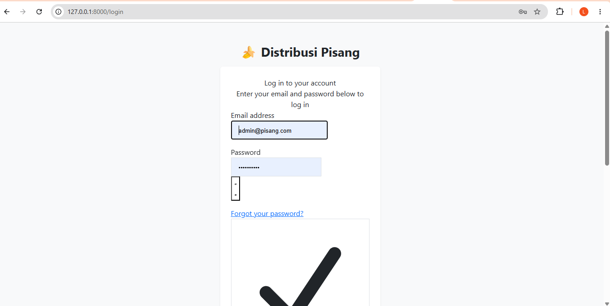
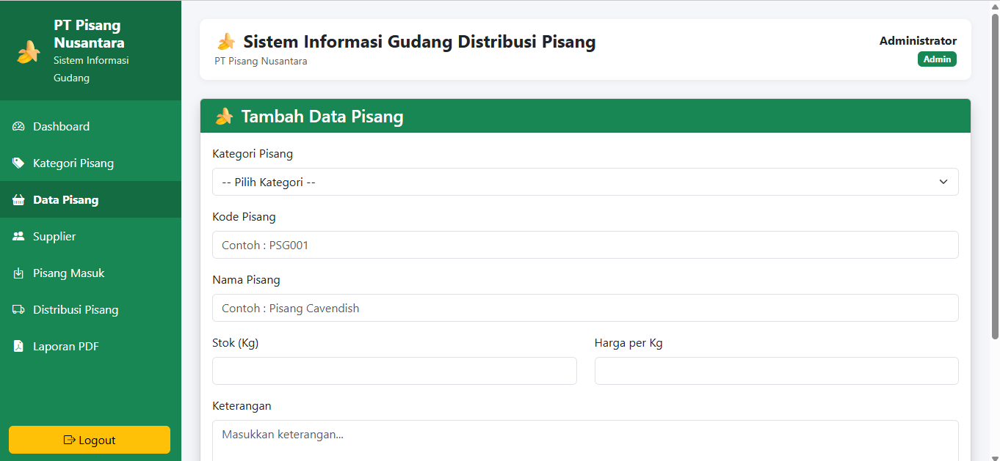
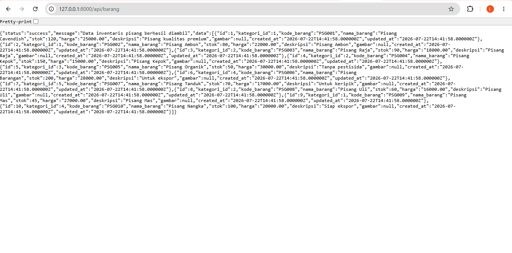
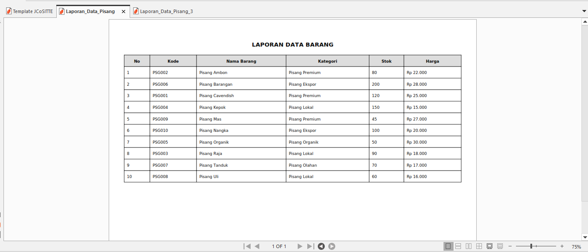
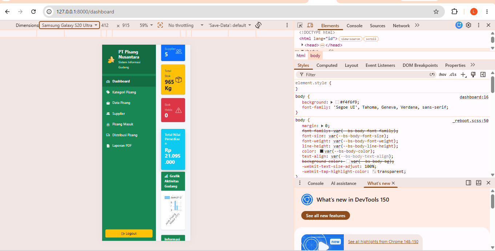

# 🍌 Sistem Informasi Gudang Jual Beli Pisang

## Deskripsi Aplikasi

Sistem Informasi Gudang Jual Beli Pisang merupakan aplikasi berbasis web yang dibuat untuk membantu proses pengelolaan data gudang pada perusahaan PT Pisang Nusantara.

Aplikasi ini digunakan untuk mengelola data jenis pisang, kategori, supplier, transaksi pisang masuk, distribusi pisang keluar, serta menyediakan laporan PDF.

Aplikasi ini dibuat menggunakan framework Laravel untuk memenuhi tugas Ujian Akhir Semester (UAS) Pemrograman Web Lanjut.


---

# Identitas Pengembang

Nama : Lola Acsyakie

Program Studi : Teknik Informatika

Universitas : Universitas Malikussaleh


---

# Teknologi yang Digunakan

Teknologi yang digunakan pada aplikasi ini:

- Laravel 13
- PHP 8.4
- MySQL
- Bootstrap 5
- Bootstrap Icons
- Laravel Fortify Authentication
- Laravel DomPDF
- Chart.js


---

# Fitur Aplikasi

## 1. Autentikasi Pengguna

Sistem menggunakan Laravel Fortify untuk proses autentikasi pengguna.

Fitur autentikasi:

- Login pengguna
- Registrasi pengguna
- Password terenkripsi
- Session pengguna


Terdapat dua jenis pengguna:


## Admin

Admin memiliki hak akses:

- Mengelola kategori pisang
- Mengelola data pisang
- Mengelola supplier
- Mengelola transaksi pisang masuk
- Mengelola distribusi pisang keluar
- Melakukan export laporan PDF


## User

User memiliki hak akses:

- Login ke sistem
- Melihat dashboard
- Melihat data pisang


---

# 2. CRUD (Create, Read, Update, Delete)

Fitur CRUD yang tersedia:


## Kategori Pisang

Admin dapat:

- Menambah kategori
- Melihat kategori
- Mengubah kategori
- Menghapus kategori


## Data Pisang

Admin dapat:

- Menambah data pisang
- Melihat data pisang
- Mengedit data pisang
- Menghapus data pisang


## Supplier

Admin dapat:

- Menambah supplier
- Melihat supplier
- Mengubah supplier
- Menghapus supplier


## Pisang Masuk

Digunakan untuk mencatat pemasukan pisang dari supplier.


## Distribusi Pisang

Digunakan untuk mencatat proses pengeluaran atau distribusi pisang.


---

# 3. Dashboard

Dashboard menyediakan informasi:

- Jumlah jenis pisang
- Jumlah supplier
- Total stok pisang
- Stok habis
- Total pisang masuk
- Total distribusi keluar
- Grafik aktivitas gudang
- Data transaksi terbaru
- Informasi stok kritis


---

# 4. Export Laporan PDF

Sistem menyediakan fitur export laporan data pisang dalam format PDF.

Isi laporan:

- Kode pisang
- Nama pisang
- Kategori
- Stok
- Harga
- Keterangan


---

# 5. Responsive Design

Tampilan menggunakan Bootstrap 5 sehingga dapat digunakan pada:

- Desktop
- Laptop
- Tablet
- Smartphone


---

# Cara Instalasi

## 1. Persiapan

Pastikan sudah terinstall:

- PHP >= 8.2
- Composer
- MySQL
- XAMPP/Laragon
- Node.js


---

## 2. Clone Repository

Jalankan perintah:

```bash
git clone https://github.com/lola230170031-create/Distribusi-Pisang.git
```


---

## 3. Masuk Folder Project

```bash
cd Distribusi-Pisang
```


---

## 4. Install Dependency Laravel

```bash
composer install
```


Install package frontend:

```bash
npm install
```


---

## 5. Konfigurasi Database

Buat database MySQL:

```
gudang_distribusi
```


Atur file `.env`:

```
DB_DATABASE=gudang_distribusi
DB_USERNAME=root
DB_PASSWORD=
```


---

## 6. Jalankan Migration dan Seeder

```bash
php artisan migrate --seed
```


---

## 7. Jalankan Aplikasi

Terminal pertama:

```bash
php artisan serve
```


Terminal kedua:

```bash
npm run dev
```


Buka browser:

```
http://127.0.0.1:8000
```


---

# Akun Demo


## Admin

Email:

```
admin@pisang.com
```

Password:

```
password
```


Hak akses:

- Mengelola seluruh data sistem
- CRUD data pisang
- Mengelola supplier
- Export laporan PDF


## User

Email:

```
user@pisang.com
```

Password:

```
password
```


Hak akses:

- Melihat dashboard
- Melihat data pisang


---

# Dokumentasi Sistem


## 1. Halaman Login

Halaman login digunakan pengguna untuk masuk ke dalam sistem.




## 2. Dashboard

Dashboard menampilkan jumlah data pisang, supplier, stok, transaksi masuk, distribusi keluar, grafik aktivitas gudang, dan informasi stok.


## 3. CRUD Data Pisang

Admin dapat melakukan tambah, lihat, ubah, dan hapus data pisang.


## 4. Hak Akses Admin dan User

Sistem memiliki dua role pengguna:

- Admin : Mengelola seluruh fitur sistem.
- User : Melihat informasi dashboard dan data pisang.





## 5. REST API

Sistem menyediakan REST API untuk data barang dan supplier.

Endpoint API:


Barang:

```
GET /api/barang
POST /api/barang
PUT /api/barang/{id}
DELETE /api/barang/{id}
```


Supplier:

```
GET /api/supplier
POST /api/supplier
PUT /api/supplier/{id}
DELETE /api/supplier/{id}
```


Pengujian dilakukan menggunakan Postman.





## 6. Export Laporan PDF

Admin dapat melakukan export laporan data pisang dalam format PDF.





## 7. Responsive Mobile

Tampilan sistem menggunakan Bootstrap 5 sehingga dapat digunakan pada perangkat mobile.



